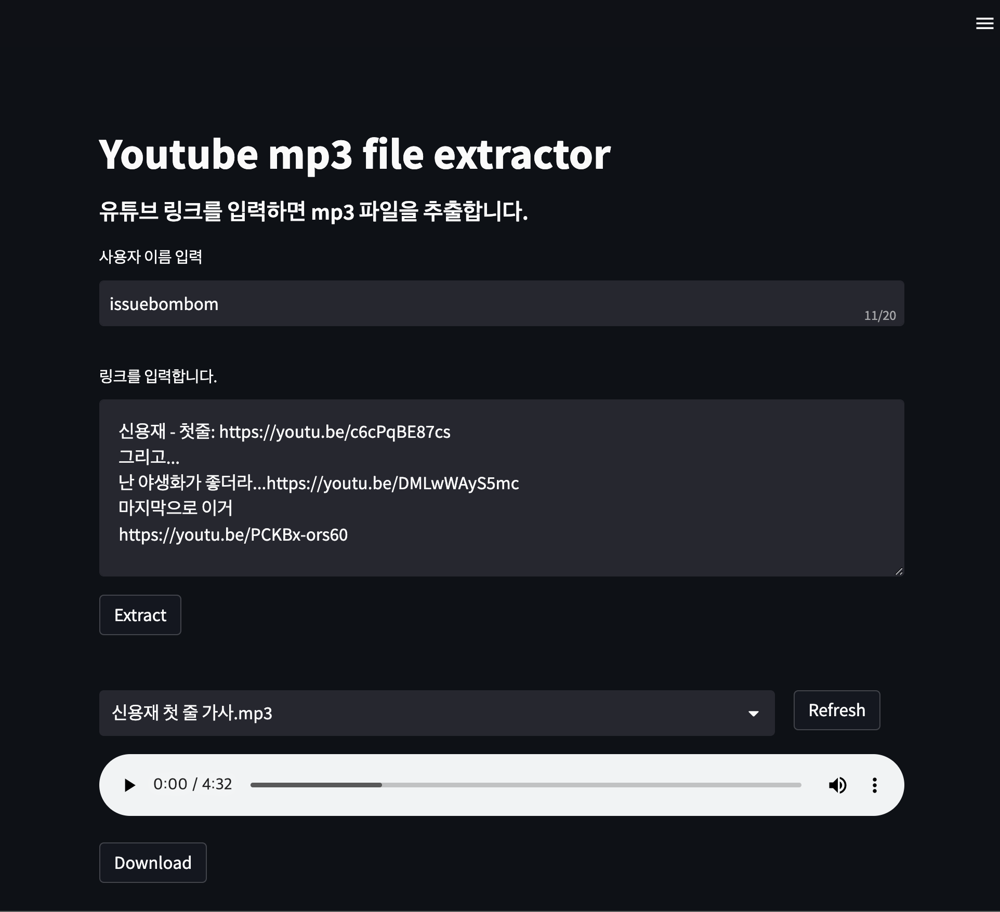

# Youtube Audio Extract and Concatenate
하나 또는 여러 개의 유튜브 링크를 입력하면 해당 영상의 mp3 파일을 각각 추출하며 원할 경우 각 파일을 하나의 mp3 파일로 합쳐줍니다.  

> 특징
- streamlit 기반으로 사이트 디자인 및 작동
- EC2, nginx, cloudflare 기반으로 배포
> 기존 유튜브 음원 추출 사이트에 없는 기능
- 추출한 파일은 지정한 사용자명에 따라 서버에 개별 저장합니다.
- 추출한 음원 중 일부를 원하는 순서에 맞춰 합쳐주는 기능을 제공합니다.
- 음원의 길이를 수정할 수 있습니다.
- 사용자 이름에 따라 추출한 파일을 각각 보관합니다.(임시 기능)
- 추출한 파일을 들어볼 수 있습니다.

> 문제점
- 파일 보관 서비스는 서버 용량에 제한이 있으니 당장에는 이를 해결하기 위한 방안 필요
    - 사용자별 유튜브 링크만 txt파일로 보관하고 추출 실행 시 일시적으로 파일 보관하고, 사이트 이탈 시 저장된 파일 제거
    - crontab을 활용한 정기적인 파일 제거

> 진행 예정(목표)
- 음원 노멀라이즈 기능
- 파일 다운로드 시 압축 후 다운로드 기능
- 구간 설정 및 해당 구간의 음원만 추출 기능 (완)
- STT(Speech to Text) 구현 및 구간별 정보 제공
- 유튜브 검색 기능 (가능 여부 확인 필요)
- CRUD 구현을 통한 유저 정보 관리
- 로그인 기능 (streamlit-authenticator or 장고 기반)
- 파일 추가
- 파일 삭제 (완)
## Requirements
Python 3.8.16  
FFMPEG
- sudo apt install ffmpeg (ubuntu)
- brew install ffmpeg (MacOS)

Main pip list
- pytube==12.1.2
- streamlit==1.17.0
- tqdm==4.64.1